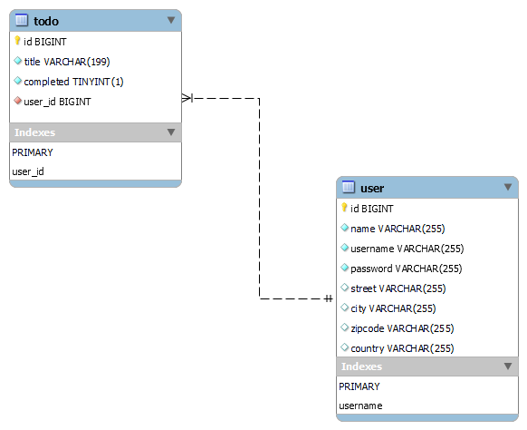

# Gestion TODO Application 
   ### MVC, JPA, Hibernate, Thymeleaf, Pageable

## Overview    
Welcome to the Gestion TODO application! This is a Spring Boot project designed for managing TODO tasks and user accounts.MySQL for the database and Thymeleaf for server-side rendering of web 
pages. You'll find basic CRUD operations (Create, Read, Update, Delete) for both TODO tasks and users.

## Database Relational Diagram

### Getting Started
Setup and Run:

## Configuration:
Java 17 or higher, MySQL Server, and Maven installed.
Update the application.properties file with your MySQL database credentials and other necessary settings.

## Build the Project:
### Clean and install the Maven project:
    mvn clean install

## Run the Application: 
###  Launch the Spring Boot application:
    mvn spring-boot:run
    
## Access the Application:  
### Open your web browser and navigate to
    http://localhost:8080/users.  
    http://localhost:8080/todos.
When prompted for login, use the default username user and the password generated in the terminal during startup. Check for the line starting with Using generated security password:.

## Features
  TODO Management: Create, update, view, and delete TODO tasks.
  User Management: Manage user accounts with ease.
  Pagination: Enjoy paginated views for both TODO tasks and users.
  Validation: Basic validation to ensure user inputs are correct.

## Prerequisites
 ### Before you get started, make sure you have the following:
   Java 17 or higher
   MySQL Server: You can download it from MySQL Downloads 
   Maven: Required for building the project

## Configuration
## Application Properties
  By default, the server runs on localhost:8080, if necessary Update your application.properties file like so:
    
   ### application.properties:
       spring.application.demo 
       **TO Configure the localhost server** 
       server.port:8090
       

   ### MYSQL Drives Configuration
    spring.datasource.url=jdbc:mysql://localhost:3306/Todo_task
    spring.datasource.username=root
    spring.datasource.password=User1234

   ### JPA and Hibernate Configuration
    spring.jpa.hibernate.ddl-auto=update
    spring.jpa.show-sql=true
    spring.jpa.properties.hibernate.dialect=org.hibernate.dialect.MySQLDialect

   ### Thymeleaf Configuration
    spring.thymeleaf.prefix=classpath:/templates/
    spring.thymeleaf.suffix=.html
    spring.thymeleaf.mode=HTML
    spring.thymeleaf.encoding=UTF-8
    spring.thymeleaf.cache=false
 
